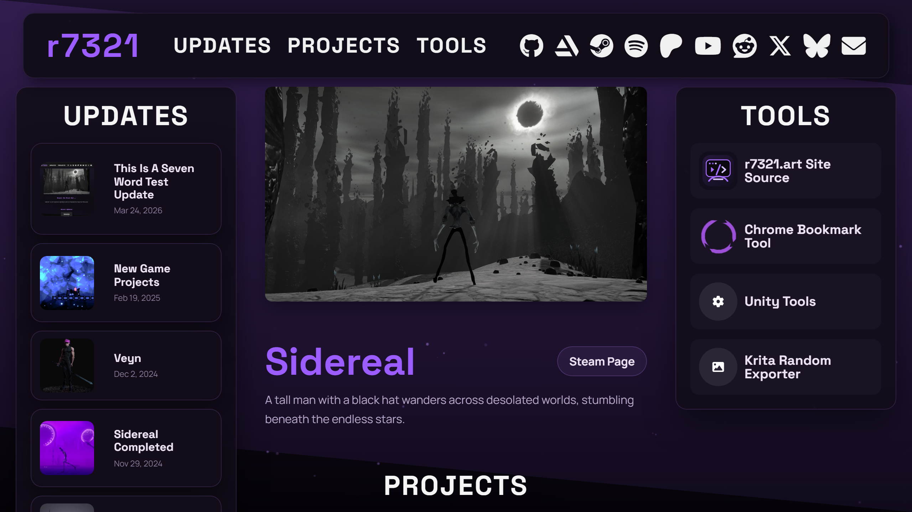

# r7321.art

Source code for `r7321.art`, the public site for Ryan Wheeler's projects, updates, and tool pages.

The site is built as a static 11ty project with markdown-driven content, shared layouts, and a simple 

## Development

Start local development:

```bash
npm run dev
```

Build the site:

```bash
npm run build
```

## Structure

- `src/content/updates` contains update posts
- `src/content/projects` contains project pages
- `src/content/tools` contains tool pages
- `src/images` contains site images and post media
- `src/_includes` contains layouts
- `src/assets` contains CSS and JavaScript

## Site Features

- standalone update pages
- standalone project pages
- update filtering by tags and project
- public tools section with individual detail pages
- generated image placeholders for smoother media loading

## Scaffolds

Starter files for new content live in:

- `scaffolds/update.md`
- `scaffolds/project.md`
- `scaffolds/tool.md`
