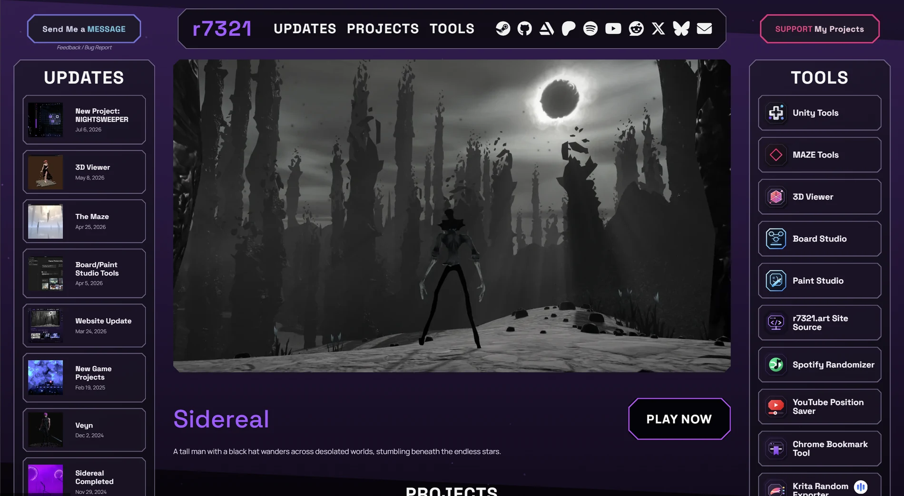

# r7321.art

This is the source for [r7321.art](https://r7321.art), my portfolio and public progress site for games, tools, and whatever else I am making.

It is an Eleventy static site with Markdown-driven content and shared layouts. A small media pipeline turns the original images and GIFs into responsive WebP images and poster-first MP4 loops, while the message page uses a separate Turnstile-protected PHP service.

This repository is mainly a public code reference and portfolio example. The private hosting configuration, credentials, and runtime data are not included.



## What's here

- Updates, projects, and tools are separate Markdown content collections.
- Shared layouts keep their index and detail pages consistent.
- The media build creates content-hashed responsive images, inline previews, and lightweight video loops.
- The message form handles feedback and bug reports through a small protected PHP service.

## Run locally

```bash
npm install
npm run dev
```

`npm run build` creates the production site in `dist/`. Starter files for new posts live in `scaffolds/`.

## Layout

- `src/content` - updates, projects, and tool pages
- `src/images` - original site images and post media
- `src/_includes` - shared layouts
- `src/assets` - CSS and browser JavaScript
- `server/support` - the message service source and example configuration
- `scripts` - build, media, browser-test, and deployment helpers
