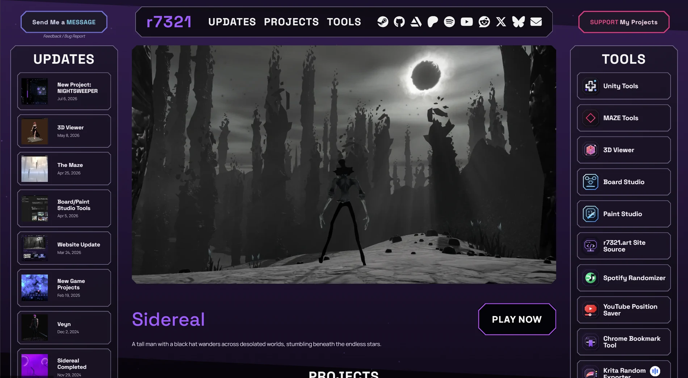

# r7321.art

This is the source for [r7321.art](https://r7321.art), my site for games, tools, updates, and whatever else I am making.

It is an Eleventy static site. A small media pipeline turns the original images and GIFs into responsive WebP images and poster-first MP4 loops. The message form sends feedback and bug reports through a PHP service in `server/support`.
